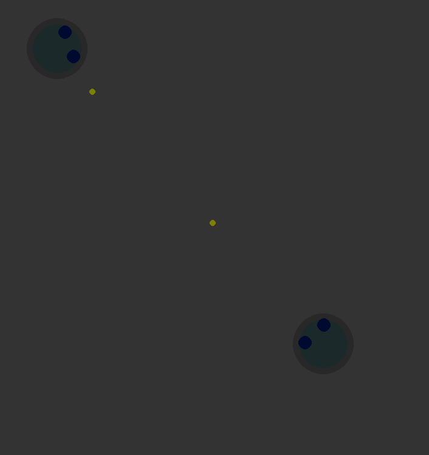

# The mini online game
Project was made in purpose of me better understanding client-server applications. It's a simple top-down multiplayer shooter, where the role of the server is handled by one of the players. Everything is ran on local machine, no internet connection required.


# Run
Before running __client__ or __server__ you need to install all the requirements via pip 

```pip install -r requirements.txt```

Then, run the server with 

```PYTHON_BINARY -m run_server```

And you're free to join the game with command

```PYTHON_BINARY -m run_client```

# TODO
1. Make global server, where all instances and addresses of localy-generated servers will be uploaded, which will allow for a real multiplayer online game.
2. Make actual level generation